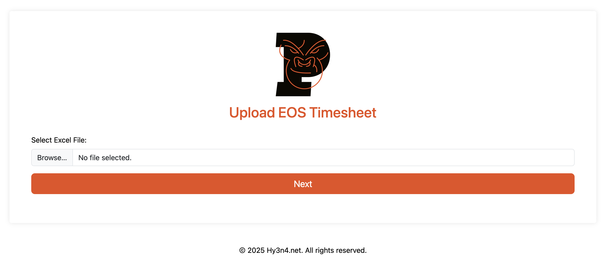

# Timesheet-Filler

A web application for processing and generating timesheet reports based on Excel files.



## Features

- Upload Excel timesheet data files
- Select a person and month to process
- Edit timesheet entries in a user-friendly web interface
- Generate Excel timesheet reports with proper formatting
- Download the generated reports
- Email processed timesheets with support for multiple providers (SendGrid, AWS SES, OCI Email, MailJet, **Resend**)

## Getting Started

### Prerequisites

- Go 1.18 or higher
- Excel template file (specified in configuration)

### Running Locally

1. Clone the repository:
```bash
git clone https://github.com/yourusername/timesheet-filler.git
cd timesheet-filler
```

2. Run the application:
```bash
go run cmd/server/main.go
```

3. Access the application at http://localhost:8080

### Environment Variables

The application can be configured using the following environment variables:

#### Core Application Settings

| Variable | Description | Default |
|----------|-------------|---------|
| PORT | HTTP server port | 8080 |
| METRICS_PORT | Prometheus metrics port | 9180 |
| TEMPLATE_DIR | Directory containing HTML templates | templates |
| TEMPLATE_PATH | Path to Excel template file | gorily_timesheet_template_2024.xlsx |
| MAX_UPLOAD_SIZE | Maximum upload file size in bytes | 16777216 (16MB) |
| FILE_TOKEN_EXPIRY | Expiry time for file tokens | 24h |
| SHEET_NAME | Excel sheet name to process | docházka správců týmu |

#### Email Configuration

| Variable | Description | Default |
|----------|-------------|---------|
| EMAIL_ENABLED | Enable email functionality | false |
| EMAIL_PROVIDER | Email service provider (sendgrid, ses, oci, mailjet, resend) | sendgrid |
| EMAIL_FROM_NAME | Sender display name | Timesheet Filler |
| EMAIL_FROM_EMAIL | Sender email address | gorily.vykaz@hy3n4.com |
| EMAIL_RECIPIENTS | Comma-separated list of default recipients | hy3nk4@gmail.com |

#### SendGrid Configuration

| Variable | Description | Default |
|----------|-------------|---------|
| SENDGRID_API_KEY | SendGrid API key | "" |

#### AWS SES Configuration

| Variable | Description | Default |
|----------|-------------|---------|
| AWS_REGION | AWS region | eu-central-1 |
| AWS_ACCESS_KEY_ID | AWS access key ID | "" |
| AWS_SECRET_ACCESS_KEY | AWS secret access key | "" |

#### OCI Email Configuration

| Variable | Description | Default |
|----------|-------------|---------|
| OCI_CONFIG_PATH | Path to OCI config file | "" |
| OCI_PROFILE_NAME | OCI profile name | DEFAULT |
| OCI_COMPARTMENT_ID | OCI compartment ID | "" |
| OCI_ENDPOINT_SUFFIX | OCI endpoint suffix | oraclecloud.com |

#### MailJet Configuration

| Variable | Description | Default |
|----------|-------------|---------|
| MAILJET_API_KEY | MailJet API key | "" |
| MAILJET_SECRET_KEY | MailJet secret key | "" |

#### Resend Configuration

| Variable | Description | Default |
|----------|-------------|---------|
| RESEND_API_KEY | Resend API key | "" |

### Email Providers

The application supports multiple email service providers:

- **SendGrid**: Popular email delivery service with reliable API
- **AWS SES**: Amazon Simple Email Service for AWS-integrated applications
- **OCI Email**: Oracle Cloud Infrastructure Email Delivery service
- **MailJet**: European email service provider with good deliverability
- **Resend**: Modern email API service with developer-friendly features

To enable email functionality:

1. Set `EMAIL_ENABLED=true`
2. Choose your provider with `EMAIL_PROVIDER` (e.g., `EMAIL_PROVIDER=resend`)
3. Configure the appropriate API keys for your chosen provider
4. Set sender information (`EMAIL_FROM_NAME`, `EMAIL_FROM_EMAIL`)
5. Optionally configure default recipients (`EMAIL_RECIPIENTS`)

#### Example Resend Configuration

```bash
export EMAIL_ENABLED=true
export EMAIL_PROVIDER=resend
export RESEND_API_KEY=re_your_api_key_here
export EMAIL_FROM_NAME="Timesheet System"
export EMAIL_FROM_EMAIL=noreply@yourdomain.com
export EMAIL_RECIPIENTS=admin@yourdomain.com,hr@yourdomain.com
```

## Docker Support

### Building the Docker Image

```bash
docker build -t timesheet-filler .
```

### Running with Docker

```bash
docker run -p 8080:8080 -p 9180:9180 timesheet-filler
```

## Kubernetes Deployment

Helm charts are provided for deploying to Kubernetes:

```bash
helm install timesheet-filler ./helm/timesheet-filler
```

## Monitoring

The application exposes Prometheus metrics at `/metrics` on the metrics port (default: 9180).

Health check endpoints:
- Liveness: `/healthz`
- Readiness: `/readyz`

## Project Structure

```
├── cmd/
│   └── server/           # Application entry point
├── internal/
│   ├── config/           # Configuration management
│   ├── handlers/         # HTTP request handlers
│   ├── middleware/       # HTTP middleware components
│   ├── models/           # Data models
│   ├── services/         # Business logic services
│   └── utils/            # Utility functions
├── templates/            # HTML templates
│   ├── favicon/          # Favicon and web manifest
│   └── *.html            # HTML templates
├── Dockerfile            # Docker build definition
└── helm/                 # Kubernetes Helm charts
```

## Development

### Running Tests

```bash
go test ./...
```

### Building the Application

```bash
go build -o timesheet-filler cmd/server/main.go
```

## License

This project is licensed under the MIT License - see the LICENSE file for details.

## Contributing

1. Fork the repository
2. Create a feature branch: `git checkout -b my-new-feature`
3. Commit your changes: `git commit -am 'Add some feature'`
4. Push to the branch: `git push origin my-new-feature`
5. Submit a pull request

## Acknowledgements

- [Excelize](https://github.com/qax-os/excelize) - For Excel file processing
- [Bootstrap](https://getbootstrap.com/) - For front-end styling
- [SortableJS](https://sortablejs.github.io/Sortable/) - For drag-and-drop reordering
